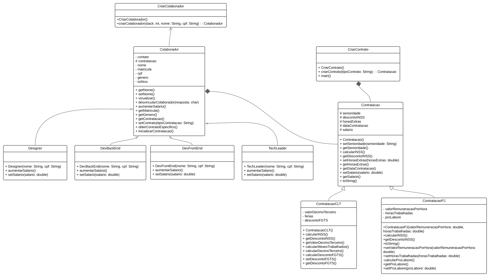

# Sistema de Gestão de Colaboradores

Bem-vindo ao Sistema de Gestão de Colaboradores! Este sistema foi desenvolvido para gerenciar colaboradores com diferentes tipos de contratos.

## Documentação

### Classes e Métodos

Aqui estão algumas informações sobre as classes e métodos principais do sistema:

#### Colaborador

- **Método Abstrato:**
  - `abstract void aumentarSalario()`: Método abstrato para aumentar o salário.

- **Métodos Concretos:**
  - `String visualizar()`: Exibe uma representação visual das informações do colaborador.
  - `void desvincularColaborador(char resposta)`: Desvincula o colaborador da empresa com base na resposta fornecida.
  - ...

#### Contratacao

- **Métodos Abstratos:**
  - `abstract double calcularINSS()`: Método abstrato para calcular o desconto do INSS.
  - `abstract double getDescontoINSS()`: Método abstrato para obter o valor do desconto do INSS.

- **Métodos Concretos:**
  - `double getHorasExtras()`: Obtém o número de horas extras trabalhadas.
  - ...

### Imagem UFVNW

Aqui está a imagem UFVNW que representa nosso sistema:

## Como Usar

1. Clone o repositório.
2. Execute o sistema.
3. Interaja com as funcionalidades oferecidas.

## Contribuição

Fique à vontade para contribuir com melhorias. Siga estas etapas:

1. Faça um fork do repositório.
2. Crie uma branch para sua contribuição: `git checkout -b feature/nova-feature`.
3. Faça commit das alterações: `git commit -m 'Adiciona nova feature'`.
4. Envie as alterações para a branch: `git push origin feature/nova-feature`.
5. Abra um Pull Request.

## Contato

Se tiver dúvidas ou sugestões, entre em contato conosco!

---

**Equipe UFVNW**
